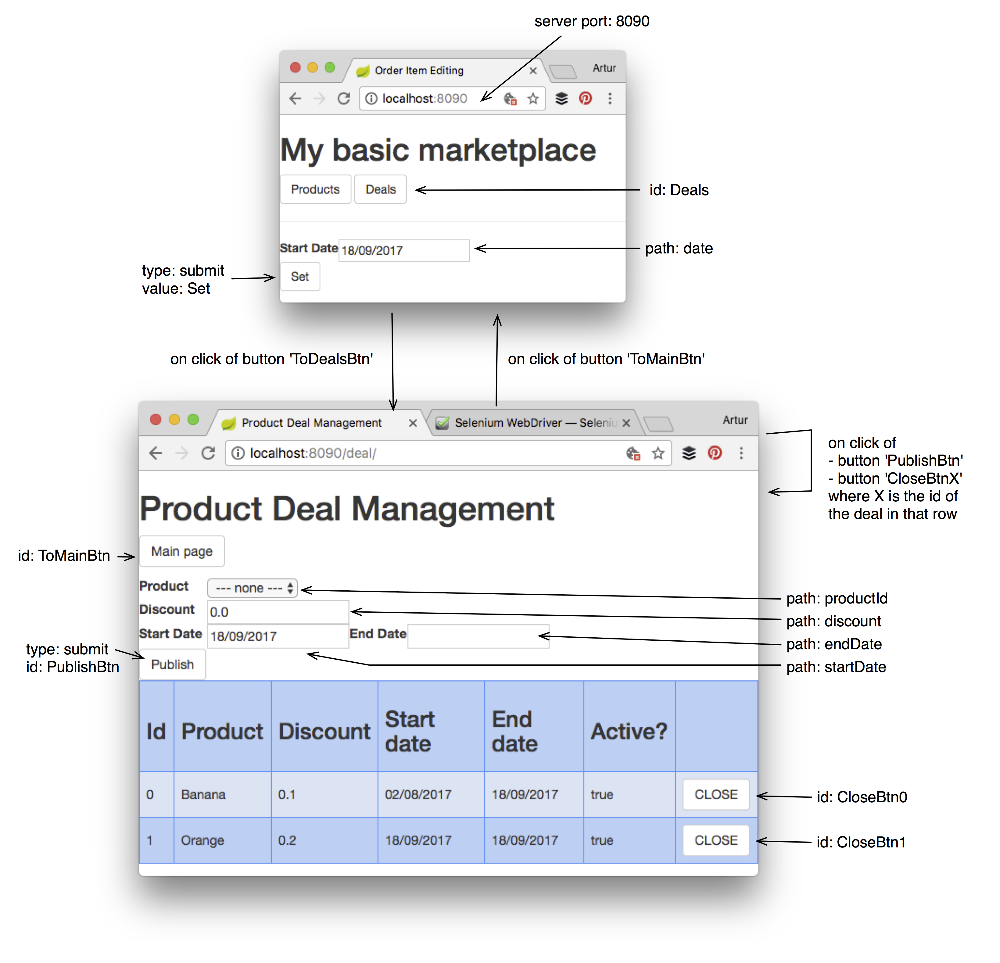

<link rel='stylesheet' href='web/swiss.css'/>

# CO2006 17-18 - SPRINT 2 - MINIPROJECT

Table of contents:
* [Plagiarism and Collusion](#disclaimer-on-plagiarism-and-collusion)
* [Exercise](#exercise)
* [Submission procedure](#submission-procedure)
* [Marks and rubric](#marks-and-rubric)

## Disclaimer on Plagiarism and Collusion

This is an **individual piece of coursework** that is assessed. Plagiarism, including collusion, is penalized. For further information check the [section Referencing and Academic Integrity in the BSc handbook](https://campus.cs.le.ac.uk/ForStudents/handbooks17/BScStudentHandbook2017-18.pdf).

By submitting your solution, you are stating that you are aware of the consequences, as summarized in the [Declaration of Academic Honesty](https://campus.cs.le.ac.uk/ForStudents/plagiarism/DoAIF.pdf) that you signed already, and that the solution provided for the worksheet is the result of your **sole individual work**.

Note that the fact that you are working with someone else in the lab sessions does not justify the co-submission of highly similar code.

## Exercise

The goal of this worksheet is to develop a functional feature for an online shop web application developed in Spring MVC and Java. The [project containing the base code](./miniproject/	) only implements a catalogue of products using the typical [CRUD operations](https://en.wikipedia.org/wiki/Create,_read,_update_and_delete).

In this sprint, you are asked to implement a market strategy policy to the system so as to meet the requirements stated below. 

The prototype must be deployed at server port `8090`.

### Codebase and location of classes to be implemented

The main (JSP) views have been implemented:
* `My basic marketplace` ([JSP code](./miniproject/src/main/webapp/WEB-INF/views/index.jsp)) 
* `Product Deal Management` ([JSP code](./miniproject/src/main/webapp/WEB-INF/views/form/productDeal.jsp)) 

The system has to be completed by developing code for the business logic/validation requirements stated below in the following methods/classes:
* Domain class [eMarket.domain.Deal](./miniproject/src/main/java/eMarket/domain/Deal.java): method `isActive()`
* Controller class [eMarket.controller.DealController](./miniproject/src/main/java/eMarket/controller/DealController.java): the handler methods and their request mapping annotations
* Data Transfer Object (DTO) class [eMarket.controller.DealFormDto](./miniproject/src/main/java/eMarket/controller/DealFormDto.java): the contents of the class
* Validator class [eMarket.controller.DealValidator](./miniproject/src/main/java/eMarket/controller/DealValidator.java): the method `validate()`

The JSP views **MUST NOT** be modified and they should be used to guide the development of the code (e.g. by using the names stated in the views). 

### Navigation [5 marks]

The following navigation model (links between pages) must be implemented:

### Business logic requirements [35 marks]

Users will be able to create two types of deals:

* `Open`: when no `end date` is provided; and
* `Closed`: when an `end date` is provided.

Take into account the following functional requirements:

* A deal is created for a product in the catalogue by selecting it from a dropdown list box and by providing a `discount` (`0.10` means `10%`) and an `start date`. If an `end date` is not provided, the deal is assumed to be ongoing until it is closed (that is, until an end date is provided). 

* In this release, deals have to be stored in memory using the list of deals `Store::dealList`.

* When a deal with id `N`, with a `start date` equals or anterior to the system date but without and `end date`, is closed (by clicking on the button `CloseBtnN`), the system date `eMarket.domain.EMarketApp::systemDate` is used as `end date` for the deal. When the `start date` is posterior to the system date, the action is ignored (that is, the system navigates to the same page without modifying the data).

* When a deal with id `N`, with a `start date` equals or anterior to the system date and with an `end date`, is closed again (by clicking on the button `CloseBtnN`), the system date is used as the new `end date` for the deal. When the `start date` is posterior to the system date, the action is ignored (that is, the system navigates to the same page without modifying the data).

* A deal is active if the interval defined by its start date and end date (if any) includes the system date. The system date is available from the property `eMarket.domain.EMarketApp::systemDate` and it can be reset from the main page `My basic marketplace` by entering a new date and clicking on the button `Set`. The method `Deal::isActive()` determines when a deal is active or not.

* Every time a deal is published or closed, the list of deals that appears at the bottom of the page `Product Deal Management` must be updated. The list of deals is to be ordered by deal identifier. 

### Validation requirements [50 marks] 

When submitting a new deal via the web form, the following validations have to be implemented:
* The start date has to use the format pattern `dd/MM/yyyy`. The method `Deal::getStartDateAsString()` can be used to obtain dates in that format.
  * Error to be reported for the corresponding date field `startDate`.
* The end date has to use the format pattern `dd/MM/yyyy`. The method `Deal::getEndDateAsString()` can be used to obtain dates in that format.
  * Error to be reported for the corresponding date field `endDate`.
* A product must be selected.  
  * Error to be reported for the field `productId`.
* The field `discount` cannot be empty (with empty string). 
  * Error to be reported for the field `discount`.
* The field `discount` has to be different from `0.0`.
  * Error to be reported for the field `discount`.
* A start date must be provided.
  * Error to be reported for the field `startDate`.
* An end date cannot precede a start date.
  * Error to be reported for the field `endDate`.
* The interval of dates provided for a given product cannot overlap with any deal previously defined for that product. Please consider all of the possible cases. A non-exhaustive list of examples of overlaps is as follows:
  * `[begin-new [begin-existing end-new] ..`
  * `[begin-new [begin-existing end-existing]`
  * `[begin-new [begin-existing .. end-existing] end-new]`
  * `[begin-new [begin-existing .. end-new] end-existing]`

### Recommended Steps

1. Implement the connection of the controller and the JSP view in order to see the web page `Product Deal Management` by:
    * Implementing the command object (also known as Data Transfer Object (DTO)) class [eMarket.controller.DealFormDto](./miniproject/src/main/java/eMarket/controller/DealFormDto.java)
    * Implementing the handler method in the controller that shows the view `productDeal`.

2. Implement the business logic requirements in:
    * the controller class [eMarket.controller.DealController](./miniproject/src/main/java/eMarket/controller/DealController.java)
    * the domain class [eMarket.domain.Deal](./miniproject/src/main/java/eMarket/domain/Deal.java): method `isActive()`
    
3. Implement the validation requirements in:
    * the validator class [eMarket.controller.DealValidator](./miniproject/src/main/java/eMarket/controller/DealValidator.java): the method `validate()`
    * the controller class [eMarket.controller.DealController](./miniproject/src/main/java/eMarket/controller/DealController.java)

## Submission procedure

### Checkpoint: Thu 26/10/2017, 9:00am

* Commit and push your mini project (the whole project) to your GitHub repository, under the folder `sprint2/miniproject` so that you can find your file `gradle.build` in `sprint2/miniproject/gradle.build` 
* The project must contain no compilation errors and it must be executable with the command `./gradlew clean bootRun` (or equivalent command for `MS Windows`).

You may want to revise :movie_camera: [this video](https://leicester.cloud.panopto.eu/Panopto/Pages/Viewer.aspx?id=fcc8ee35-cee8-4b83-9c02-38de6bacd81b) for moving files from the master repository to your private repository on GitHub. The actual files that are copied and submitted are different and that is part of the exercise. 

### Release: Tue 7/11/2017, 9:00am

* The steps for the checkpoint, as explained above, should have been implemented. 
* Make a release on GitHub
  1. Open the repo in Github
  2. Click Releases
  3. Click `Create a new release` 
  4. Enter the `Tag Version` as `sprint2` (leave `@ Target Master`)
  5. Enter the `Release Title` as `Sprint 2 submission`
  6. Click `Publish Release` 

## Marks and Rubric

This assignment is worth **20%** of the overall module mark and the mark is provided out of **100**:
* 10% for the checkpoint submission
* 90% for the release submission

### CHECKPOINT SUBMISSION (10%)

We are going to consider that the software infrastructure for the assignment is set up:
1. The code is available in your repository the right location: 5 marks
2. The `./gradlew bootRun` command can be executed without problems: 5 marks

### RELEASE SUBMISSION (90%)

The submitted project must compile and it must be executable as explained in the worksheet (e.g. there are compilation errors) with the command `./gradlew clean bootRun`. Otherwise, the submission will receive a mark of `0` (`zero`).

The following aspects are going to be considered when marking your release submission:

#### Navigation and business logic [40 marks]

The following marking guidelines correspond to the implementation of the business logic: 
* The mockup interface described for page `Product Deal Management` must be integrated within the code developed for the system to be marked, that is, no compilation errors are allowed.
* Each of the navigation routes described will be marked as either correct or incorrect. 
* Each of the functional requirements described above will be marked as either correct or incorrect. Determining the number of cases to be considered in the method `Deal::isActive()` is part of the exercise. This method will be marked by checking the method with deals that are active and with deals that are inactive.
 
A more detailed breakdown of the mark for this component is as follows:
 
| requirement | marks |
|--|--|
| Navigation: from `My basic marketplace` to `Product Deal Management` | 2.5 |
| Navigation: from `Product Deal Management` to `My basic marketplace` | 2.5 |
| Logic: publish an open deal (no end date). | 3.75 |
| Logic: publish a closed deal. | 3.75 |
| Logic: close an open deal. | 3.75 |
| Logic: close a closed deal. | 3.75 |
| Logic: displaying when a deal is active, with respect to the system date. | 20 | 
 

#### Validation [50 marks]

The following marking guidelines correspond to the implementation of the validation scenarios described above:
* Each of the validation scenarios will be marked as either correct or incorrect. Errors should be reported by using messages next to the field containing the cause of the error in the view.
* Determining the number of cases to be considered when checking overlapping intervals of dates is part of the exercise. We will test the functionality using scenarios covering all possible overlaps and scenarios where there is no overlap.

A more detailed breakdown of the mark for this component is as follows:
 
| requirement | marks | number of cases |
|--|--|--|
| Validation: checking correct overlaps between dates and reporting errors | 32.5 | to be split by the number of cases |
| Validation: checking other validation rules | 17.5 | 2.5 x 7 rules |  
 

***
&copy; Artur Boronat, 2017-18