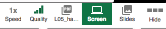

<link rel='stylesheet' href='./web/swiss.css'/>

# Sprint 2: Spring MVC (business logic and validation)

In this sprint, we are going to focus on how to build web applications using Java and the MVC architectural style.

We are going to use Java Server Pages (JSPs) to create dynamically generated web pages based on HTML and we are going to assume that you are familiar with basic HTML. If you need to learn/revise the basics of HTML, then I recommend going through :movie_camera: [this one-hour tutorial on Pluralsight](https://app.pluralsight.com/library/courses/teaching-kids-basic-html/table-of-contents) to understand what HTML is and how to use it.

JSPs are just one of the many technologies used nowadays to implement web app views that follow an MVC architectural style. We are going to learn the basics of JSPs and there are assessed exercises that involve the use of JSPs, however you will not be required to develop JSP views.

Table of contents:
* [Sprint Goal](https://github.com/uol-inf/CO2006-17-18/tree/master/sprint2#the-sprint-goal-assessed-coursework)
* [Week 1: Spring MVC](https://github.com/uol-inf/CO2006-17-18/tree/master/sprint2#week-1-spring-mvc-and-spring-boot) 
  * [What to focus on?](https://github.com/uol-inf/CO2006-17-18/tree/master/sprint2#what-to-focus-on-during-this-week) 
  * [Pluralsight resources](https://github.com/uol-inf/CO2006-17-18/tree/master/sprint2#pluralsight-resources) 
  * [Exercises](https://github.com/uol-inf/CO2006-17-18/tree/master/sprint2#exercises-formative-coursework) 
* [Week 2: JSP views and form validation](https://github.com/uol-inf/CO2006-17-18/tree/master/sprint2#week-2-java-server-pages-and-validation) 
  * [What to focus on?](https://github.com/uol-inf/CO2006-17-18/tree/master/sprint2#what-to-focus-on-during-this-week-1) 
  * [Pluralsight resources](https://github.com/uol-inf/CO2006-17-18/tree/master/sprint2#what-to-focus-on-during-this-week-1) 
  * [Exercises](https://github.com/uol-inf/CO2006-17-18/tree/master/sprint2#exercises-formative-coursework-1) 
* [Additional examples](https://github.com/uol-inf/CO2006-17-18/tree/master/sprint2#additional-examples) 
* [Revision sessions](https://github.com/uol-inf/CO2006-17-18/tree/master/sprint2#revision) 
* [Jargon buster](https://github.com/uol-inf/CO2006-17-18/tree/master/sprint2#jargon-buster-) 
* [Reference documentation](https://github.com/uol-inf/CO2006-17-18/tree/master/sprint2#additional-resources-for-reference) 
  * [Java resources](https://github.com/uol-inf/CO2006-17-18/tree/master/sprint2#java-resources)

## The Sprint Goal (assessed coursework)

The goal of this Sprint is to develop a web application: 

* :dart: [mini project worksheet](./miniproject.md) (the link will not work until the worksheet is released):
  * **marks: 100, weight: 20%** of overall mark
  * [checkpoint](https://github.com/uol-inf/CO2006-17-18/blob/master/sprint2/miniproject.md#checkpoint-thu-26102017-900am): **Thursday 26th October, 9 am, weight 10 % of sprint 2**
  * [release](https://github.com/uol-inf/CO2006-17-18/blob/master/sprint2/miniproject.md#release-thu-2112017-900am): **Tuesday 7th November, 9 am, weight 90 % of sprint 2**
  * this assessment is **individual** and you should not work with other students in your solution, which is penalised as [a form of plagiarism (namely, collusion)](https://campus.cs.le.ac.uk/ForStudents/plagiarism/DoAIF.pdf)

## Week 1. Spring MVC and Spring Boot 

* Lecture 04 on Spring MVC (apologies for the many interruptions cause by the wireless microphone)
  * :movie_camera: [L04a](https://leicester.cloud.panopto.eu/Panopto/Pages/Viewer.aspx?id=c19a38f4-6de1-47f3-b5f0-90ee598c72a5)
  * :movie_camera: [L04b](https://leicester.cloud.panopto.eu/Panopto/Pages/Viewer.aspx?id=44f58168-c323-44d0-9bad-6d410c9a0599)
  * :movie_camera: [L04c](https://leicester.cloud.panopto.eu/Panopto/Pages/Viewer.aspx?id=2d685e8f-9979-4d2c-9367-c4f7251e63ad)
  * :movie_camera: [L04d](https://leicester.cloud.panopto.eu/Panopto/Pages/Viewer.aspx?id=a0d3b91f-8aa1-436d-b45d-3c59c07e9427)
  * :notebook: [Lecture 04 handouts](./L04_handouts.pdf)

### What to focus on during this week?

* What is Spring MVC? and Spring Boot?
* What is a software architecture? 
  * Examples of software architectures: MVC, n-tier
* Techniques to design software architectures: layering
* What is a controller? What is the request/response lifecycle in an MVC web application?
* Implementation of the MVC architectural style in Spring, aka Spring MVC
  * Component
  * Controller
  * Service
  * Repository
* Implementation of controllers

### Pluralsight resources

* :movie_camera: [Introduction to Spring MVC](https://app.pluralsight.com/player?course=springmvc-intro&author=bryan-hansen&name=springmvc-m1-intro&clip=0&mode=live)
* :movie_camera: [Building](https://app.pluralsight.com/player?course=springmvc-intro&author=bryan-hansen&name=springmvc-m2-building&clip=0&mode=live): this unit should be watched for the sake of completeness in order to follow the rest of the tutorial on Pluralsight. However, we are going to simplify the configuration process by avoiding the use of XML, as illustrated in [exercise 01](./SpringMvc_ex01/readme.md). Check the guide on how to migrate Pluralsight projects to Gradle and Spring Boot below. 
* :movie_camera: [Architecture](https://app.pluralsight.com/player?course=springmvc-intro&author=bryan-hansen&name=springmvc-m3-architecture&clip=0&mode=live)
* :movie_camera: [Controllers](https://app.pluralsight.com/player?course=springmvc-intro&author=bryan-hansen&name=springmvc-m4-controllers&clip=0&mode=live)

### Exercises (formative coursework)
* :computer: [exercise 01](./SpringMvc_ex01/readme.md): setting up your first Java web application
  * :computer: [solution](./SpringMvc_ex01_solution/) (this link will be enabled when the solution is released)
* :computer: exercises from Pluralsight (under tab `Exercise files` of the [tutorial Spring MVC fundamentals](https://app.pluralsight.com/library/courses/springmvc-intro/exercise-files)): 
  * :computer: [guide to migrate projects from Maven and XML configuration to Gradle and Spring Boot](./MigratingToGradle.md). The main differences that we are going to find are:
  * Gradle (instead of Maven) for simplifying the build of a web application and for configuring dependencies; and
  * Spring Boot for configuring Spring MVC (instead of using XML files).
* :computer: [exercise 02](./SpringMvc_ex02/readme.md): developing controllers in order to practise with `@MappingRequest`
  * :computer: [solution](./SpringMvc_ex02_solution/) (this link will be enabled when the solution is released)
  
Solutions to exercises will be posted under this folder on GitHub as projects with the name `${ExerciseName}_solution`.

## Week 2. Java Server Pages and Validation

In this week we will cover the use of JSP views using 
  * HTML, 
  * the EL (Expression Language), and 
  * tag libraries - namely JSTL for UI logic and Spring forms for implementing web forms;

and error validation using the Spring validation library. 

* :movie_camera: [Lecture 05](https://leicester.cloud.panopto.eu/Panopto/Pages/Viewer.aspx?id=37b86aad-6c6f-445b-a02e-cfce9a972f3e) (in Panopto, click on the icon `Screen`  to see what was projected in the lecture)
  * :notebook: [Lecture 05 handouts](./L05_handouts.pdf)

### What to focus on during this week?
* Views
  * What is a view in Spring MVC?
  * What is the connection between a view and a controller? and between a view and the model?
  * How are views resolved?
  * What is JavaServer Pages? What are the main components of a JSP page?
* What is the JSTL?
  * How is it used to implement views?
  * How can you generate snippets of HTML code depending on conditions?
  * How can you generate the same HTML code for all the elements of a collection?
  * What is the Spring expression language (SpEL) used for?
* What are the main Spring form tags?
  * What is the command object?
  * How can you post information to a controller?
  * How can you define a drop-down list and select elements from that list?
* What is validation?
  * What is the difference between constraint validation and business logic validation?
  * What is the goal of a class implementing the `Validator` interface?
  * What is the class `BindingResult` used for?
  * How can we validate the data received by a controller request handler method?
  * How are error messages displayed in the interface?

### Pluralsight resources

* :movie_camera: [Views](https://app.pluralsight.com/player?course=springmvc-intro&author=bryan-hansen&name=springmvc-m5-views&clip=0&mode=live)
* :movie_camera: [Tag libraries](https://app.pluralsight.com/player?course=springmvc-intro&author=bryan-hansen&name=springmvc-m6-tags&clip=0&mode=live)
* :movie_camera: [Validation](https://app.pluralsight.com/player?course=springmvc-intro&author=bryan-hansen&name=springmvc-m7-validation&clip=0&mode=live)

### Exercises (formative coursework)
* :computer: [exercise 03](./SpringMvc_ex03/readme.md): handling HTTP requests and Spring forms
  * :computer: [solution](./SpringMvc_ex03_solution/) (this link will be enabled when the solution is released)
* :computer: [exercise 04](./SpringMvc_ex04/readme.md): developing a master/detail GUI with JSTL
  * :computer: [solution](./SpringMvc_ex04_solution/) (this link will be enabled when the solution is released)
* :computer: [exercise 05](./SpringMvc_ex05/readme.md): validation
  * :computer: [solution](./SpringMvc_ex05_solution/) (this link will be enabled when the solution is released) 

Solutions to exercises will be posted under this folder on GitHub as projects with the name `${ExerciseName}_solution`.

### Additional examples
     
* The project [spring-mvc-showcase](https://github.com/spring-projects/spring-mvc-showcase) demonstrates how to use the spring tag library.
  * This [JSP file (line 70)](https://github.com/spring-projects/spring-mvc-showcase/blob/master/src/main/webapp/WEB-INF/views/form.jsp) shows how to use a dropdown list in the view.
  * The class [FormController.java (line 40)](https://github.com/spring-projects/spring-mvc-showcase/blob/master/src/main/java/org/springframework/samples/mvc/form/FormController.java) contains the code that initializes the form from the controller.
* [Example of how to use a Spring MVC dropdown list](https://www.mkyong.com/spring-mvc/spring-mvc-dropdown-box-example/) (mkyong.com): the author is using XML configuration for Spring MVC and Maven. Please use the following resources if you want to run this example in your machine:
  * the Java configuration provided in [exercise 01](./SpringMvc_ex01/readme.md) (the one that we are using  for all our Spring MVC projects)
  * the [migration guide from Maven to Gradle](.MigratingToGradle.md)

### Revision

  * :movie_camera: [Revision lecture 1: exercises 1 and 2](https://leicester.cloud.panopto.eu/Panopto/Pages/Viewer.aspx?id=5601e139-41fd-4096-bfbd-3409445c7b2e)
  * :movie_camera: [Revision lecture 2: exercises 3 and 4](https://leicester.cloud.panopto.eu/Panopto/Pages/Viewer.aspx?id=0616d12d-0577-409b-a330-7452acb2e07d)
  * :movie_camera: [Revision lecture 3: exercise 5 and lambda expressions](https://leicester.cloud.panopto.eu/Panopto/Pages/Viewer.aspx?id=bc5422c9-c58c-4d92-ab67-3d740f0f457c)
    * [This code snippet](https://github.com/uol-inf/CO2006-17-18/blob/master/sprint2/miniproject/src/main/java/eMarket/controller/ProductController.java#L32) shows how to rewrite Java lambda expressions as standard code in Java (pre Java 8), as used in last part of the session.

## Jargon buster 

| term  | definition | source |
|-------|------------|--------|
| Java annotation |  Annotations, a form of metadata, provide data about a program that is not part of the program itself. Annotations can be used to inform the compiler in order to detect errors or suppress warnings. For example, the `@Override` annotation informs the compiler that the element is meant to override an element declared in a superclass. While it is not required to use this annotation when overriding a method, it helps to prevent errors. If a method marked with @Override fails to correctly override a method in one of its superclasses, the compiler generates an error. | [Java tutorial](https://docs.oracle.com/javase/tutorial/java/annotations/index.html) |
| Dispatcher servlet | the entry/configuration point for the application | [Introduction to Spring MVC](https://app.pluralsight.com/player?course=springmvc-intro&author=bryan-hansen&name=springmvc-m1-intro&clip=6&mode=live) |
| Controller | class that handles a request and determines which view should be displayed |  [Introduction to Spring MVC](https://app.pluralsight.com/player?course=springmvc-intro&author=bryan-hansen&name=springmvc-m1-intro&clip=6&mode=live)|
| Request mapping | the url and request type that a method is tied to | [Introduction to Spring MVC](https://app.pluralsight.com/player?course=springmvc-intro&author=bryan-hansen&name=springmvc-m1-intro&clip=6&mode=live) |
| ViewResolver | used to locate JSP pages (or the desired view) | [Introduction to Spring MVC](https://app.pluralsight.com/player?course=springmvc-intro&author=bryan-hansen&name=springmvc-m1-intro&clip=6&mode=live) |
| POJO | Plan Old Java Object (that is, an instance of a Java class) | [Introduction to Spring MVC](https://app.pluralsight.com/player?course=springmvc-intro&author=bryan-hansen&name=springmvc-m1-intro&clip=6&mode=live) |
| Bean | A Spring configured POJO (that is, an instance of a Java class that is used by Spring) | [Introduction to Spring MVC](https://app.pluralsight.com/player?course=springmvc-intro&author=bryan-hansen&name=springmvc-m1-intro&clip=6&mode=live) | 

## Additional resources (for reference)

These are pointers to official documentation in case you need to deepen your knowledge when implementing the mini project:
* [HTML (w3schools tutorial)](http://www.w3schools.com/html/)
  * [online try it yourself HTML editor](http://www.w3schools.com/html/tryit.asp?filename=tryhtml_default)
* Spring MVC
  * [Nicholas S. Williams. Professional Java for Web Applications. Addison-Wesley. 2014.](http://readinglists.le.ac.uk/items/51133F43-7D8E-3A7B-952C-6DA5DC168B73.html?referrer=%2Flists%2FAE79369B-4CED-C912-2150-5BD837030B59.html%23item-51133F43-7D8E-3A7B-952C-6DA5DC168B73) (link to ebook on Library catalogue): this book covers the notions of Spring MVC that we are learning through videos and guided exercises. Uses XML configuration though.
  * [Official documentation about Spring Web MVC](https://docs.spring.io/spring/docs/current/spring-framework-reference/web.html#spring-web)
    * [about controllers](https://docs.spring.io/spring/docs/current/spring-framework-reference/web.html#mvc-controller)
    * [about @RequestMapping](https://docs.spring.io/spring/docs/current/spring-framework-reference/web.html#mvc-ann-requestmapping)
    * [about @RequestMapping handler methods](https://docs.spring.io/spring/docs/current/spring-framework-reference/web.html#mvc-ann-methods) (Java methods in a controller)
  * [More examples with `@RequestMapping`](http://www.byteslounge.com/tutorials/spring-mvc-requestmapping-example)
  * [Another example of master/detail interface using Spring MVC forms](http://www.mkyong.com/spring-mvc/spring-mvc-form-handling-example/)
* [Spring Expression Language](https://docs.spring.io/spring/docs/current/spring-framework-reference/core.html#expressions): this is the Expression Language used in Spring MVC
* [JSTL core tag library (tutorialspoint)](http://www.tutorialspoint.com/jsp/jsp_standard_tag_library.htm)
* [Spring form tag library](https://docs.spring.io/spring/docs/current/spring-framework-reference/web.html#mvc-view-jsp-formtaglib)

### Java resources

  * A list of resources to revise Java is available [here](https://github.com/uol-inf/java-resources).

